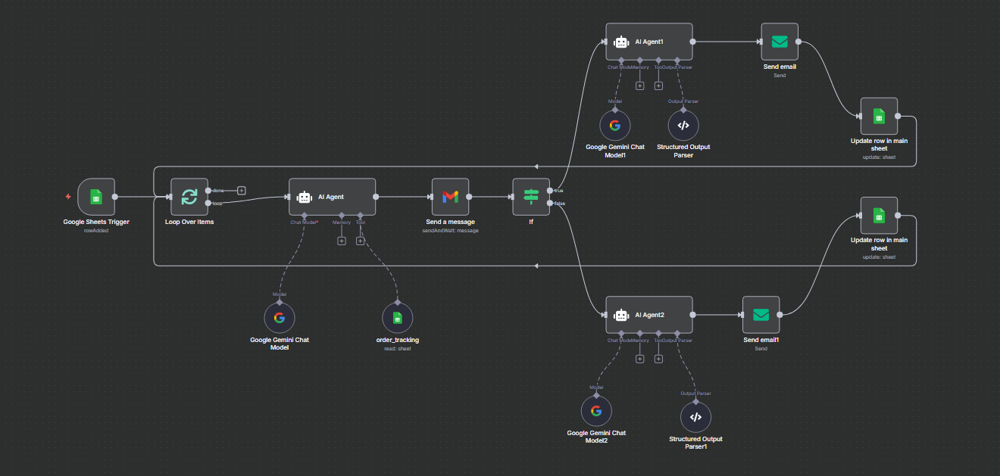

## 🗾 **Title and Short Intro**

**Project Title:**  
**Agentic AI Customer Complaints Handling System**

**Short Introduction:**  
This project is an **AI-powered automation system** designed to handle and resolve customer complaints efficiently.  
It uses **Google Sheets**, **Google Gemini AI**, and **n8n** to automate the entire complaint resolution process — from reading new complaints to drafting emails, getting team feedback, and sending final responses to customers.
The AI automatically drafts complaint resolutions, making the work of the customer support team faster and easier. This eliminates the need for them to spend extra time thinking about each complaint resolution, allowing them to process complaints more quickly and handle a larger number of complaints — ultimately boosting overall productivity and efficiency.  
This system helps companies save time and allows their customer support teams to handle **more complaints in less time, hence benefiting company's business**.

---

## 🚀 **Features**

- ✅ Automatically detects new customer complaints from Google Sheets.  
- 🧠 Uses **Google Gemini AI** to generate complaint summaries and draft resolutions. 
- 🤖 AI automatically drafts complaint resolutions, making the work of the customer support team much easier. 
- 📩 Sends emails to the customer support team for approval,decline or feedback.  
- 🔁 Based on feedback, AI prepares and sends the **final email** to the customer.  
- 🗂 Updates the main Google Sheet with the latest complaint status automatically.  
- ⏱ Runs every minute, ensuring real-time updates and responses.  
- 📈 Improves productivity — support team can handle up to **2x more complaints daily**.

---

## ⚙️ **Workflow Overview**

1. **Google Sheets Trigger**  
   - Checks every minute for new customer complaints.  

2. **Loop Over Items**  
   - Processes each new complaint one by one.  

3. **AI Agent (Google Gemini)**  
   - Reads the complaint and fetches order details from the `order_tracking` sheet.  
   - Drafts a resolution email for the support team with summary, solution, and feedback options.  

4. **Send Message (Gmail)**  
   - Sends the draft email to the support team.  

5. **IF Node**  
   - Waits for feedback (Approve, Decline, Improve, or Worsen Resolution).  

6. **AI Agent 1 (Approved cases/Approved but modify resolution)**  
   - Creates a final customer email if resolution is approved/modified.  

7. **AI Agent 2 (Declined)**  
   - Creates a final customer email if resolution is Declined. 

8. **Send Email**  
   - Sends the final email to the customer.  

9. **Update Row in Google Sheet**  
   - Updates complaint status (Approved, Declined, Complaint Closed, etc.)  

---

## 🖼 **Workflow Diagram Section**

Here’s the visual layout of your workflow 👇  

**Workflow Overview Image:**  
  

🧩 **Main Components:**  
- Google Sheets Trigger  
- Loop Over Items  
- AI Agent (Gemini)  
- Send Message (Gmail)  
- IF Node  
- AI Agent 1 & 2  
- Structured Output Parsers  
- Email Sending  
- Google Sheet Updater  

This visual flow ensures every complaint is processed end-to-end automatically.

---

## 🛠 **Requirements**

- **n8n (Self-hosted or Cloud)**  
- **Google Gemini API access**  
- **Google Sheets API** (for main and order_tracking sheets)  
- **Gmail integration**   
- **Internet connection** for live triggers and email sending  

---

## 🔑 **Setup Steps**

1. **Install n8n**  
   ```bash
   npm install n8n -g
   n8n start
   ```

2. **Create Google Sheets Credentials**  
   - Go to [Google Cloud Console](https://console.cloud.google.com/)  
   - Enable Google Sheets & Gmail API  
   - Use credentials and connect them inside n8n  

3. **Setup Sheets**  
   - `main_sheet`: For storing customer details , complaints , status etc.
   - `order_tracking`: For storing customer order details like delivery date etc.  

4. **Add Google Sheets Trigger Node**  
   - Trigger: `on new row`  
   - Interval: `every 1 minute`  

5. **Add AI Agent (Google Gemini Chat Model)**  
   - Connect to Gemini API  
   - Use prompt to generate resolution and email draft  

6. **Add Gmail Node**  
   - Configure to send emails from your official support address  

7. **Add IF Node**  
   - Conditions: Approved / Declined  

8. **Add AI Agent 1 & AI Agent 2**  
   - Agent 1 → For Approved complaints/Approved but modify resolution 
   - Agent 2 → For Declined complaints  

9. **Add Update Row Node**  
   - Update complaint status and AI output in the main sheet  

10. **Activate Workflow**  
    - Click “Activate” in n8n so it runs every minute automatically  

---

## 📧 **Example Flow**

**Step 1:**  
Customer submits complaint → added to Google Sheet  

**Step 2:**  
AI reads complaint and order info → drafts email with summary and resolution suggestion  

**Step 3:**  
Support team receives email → suggest feedback ( Approve Resolution / Approve but modify resolution / Decline Resolution) 

**Step 4:**  
AI prepares the final customer email based on team feedback  

**Step 5:**  
Customer receives the email → status updated in main Google Sheet  

---

## 📌 **Use Cases**

- 🤖 **AI-Assisted Resolution Drafting:** The AI automatically drafts complaint resolutions, reducing the effort needed by 
      the support team. This helps them process complaints faster, handle more complaints efficiently, and significantly boost overall productivity.
- 🧩 **Customer Support Automation:** Automatically handles repetitive complaint emails.  
- 🕚 **Time Saving:** Support team can handle 2× more complaints daily compared to manual processing.  
- 🧠 **AI-Driven Resolutions:** AI drafts complaint summaries and resolutions based on company policies.  
- 💬 **Consistent Communication:** Ensures all customers receive professional and timely responses.  
- 📊 **Business Growth:** Increases efficiency, reduces response time, and improves customer satisfaction.

